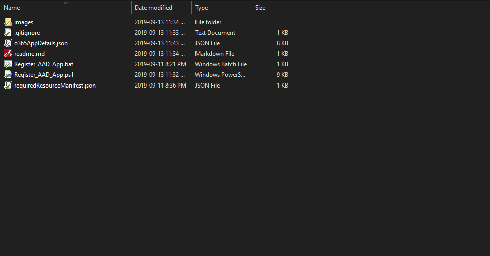
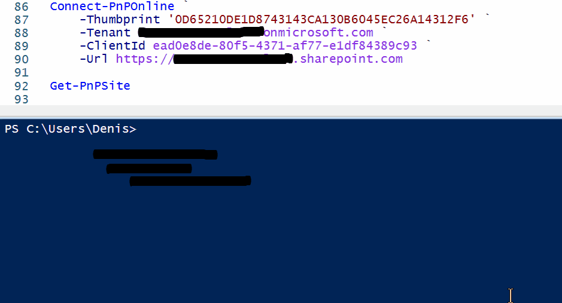

# Create an Azure App Registration with a certificate with a few clicks

## Scenarios
1. Suppose, you are working for the company that enforces MFA policy across all user accounts. This makes it hard to use PowerShell PnP for remote deployments via Azure DevOps or Azure Automation. As an alternative to disabling MFA, we can register an Azure AD app and assign Full control to the SharePoint Tenant. 
2. Suppose you need to register an Azure App registration for a service or a product that does not have an automated way of doing it. It can be a pain to create a certificate manually, upload it to the Azure app registration, request concent for the permissions, etc. Why don't you just run a batch script that does it all at once?

## What script does
The script will automatically:
- Generate self-signed password-protected certificate
- Generate random secure password
- Register a new Azure AD app
- Upload certificate to the registered app
- Grant Full Control to SharePoint sites
- Grant Admin's consent
- Save the results in the same folder


## Modify the requiredResourceManifest.json
Optionally, you can modify the requiredResourceManifest.json script to change the permissions that the Azure App registration will have. Alternatively, you can just create it as-is and then request permissions via the Azure portal. Remember, this is an easy part. Creating a certificate is the difficualt part that is being automated here.

## Permissions mentioned in the requiredResourceManifest.json
By default, the requiredResourceManifest.json defines:
- Sites.FullControl.All  (678536fe-1083-478a-9c59-b99265e6b0d3)
- TermStore.ReadWrite.All  (c8e3537c-ec53-43b9-bed3-b2bd3617ae97)
- User.ReadWrite.All  (741f803b-c850-494e-b5df-cde7c675a1ca)


## Prerequisites
- [Install Azure CLI](https://docs.microsoft.com/en-us/cli/azure/install-azure-cli-windows?view=azure-cli-latest)
- `Install-Module -Name SharePointPnPPowerShellOnline -Force`
- `Install-Module -Name "PnP.PowerShell" -Scope CurrentUser`
- The script needs to be run by the Global Office 365/Azure Administrator

## Let's Register an AD App

- Right-click on the `Register_AAD_app.bat` and run as administrator

- Enter credentials for the Office 365 Global admin



- Open `AppDetails.json` file and copy the `certificatePassword` value to the clipboard

- Install DeploymentApp.pfx certificate by using the copied password


- Done. Now you can connect to SharePoint via Powershell PnP

## To test it, Let's connect to SharePoint with PnP PowerShell
```
Connect-PnPOnline `
    -Thumbprint '<Certificate thumbprint>' `
    -Tenant <TENANT>.onmicrosoft.com `
    -ClientId <CLIENT/ADPP ID> `
    -Url https://<TENAMT>.sharepoint.com

```
## Connect to SharePoint with PnP PowerShell. Example

```
Connect-PnPOnline `
    -Thumbprint '&CA93F4CA9C32A490361986AB3170EC8E1FAFFB9' `
    -Tenant contoso.onmicrosoft.com `
    -ClientId ab32c27b-37be-4824-8af0-e8d303553d9e `
    -Url https://contoso.sharepoint.com
    
Get-PnPSite
# See the list of site collections
```

## Demo

