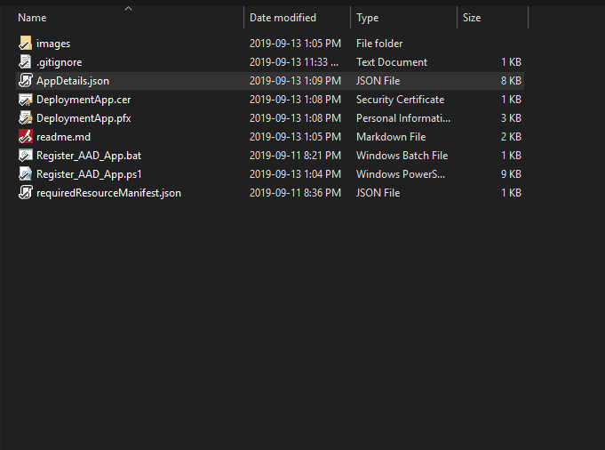

# Goal and Use Case

Suppose, you are working for the company that enforces MFA policy across all user accounts. This makes it hard to use PowerShell PnP for remote deployments via Azure DevOps or Azure Automation. As an alternative to disabling MFA, we can register an Azure AD app and assign Full control to the SharePoint Tenant. 


## What script does
The script will automatically:
- Generate self-signed password-protected certificate
- Generate random secure password
- Register a new Azure AD app
- Upload certificate to the registered app
- Grant Full Control to SharePoint sites
- Grant Admin's consent
- Save the results in the same folder


## Prerequisites
- [Install Azure CLI](https://docs.microsoft.com/en-us/cli/azure/install-azure-cli-windows?view=azure-cli-latest)
- `Install-Module -Name SharePointPnPPowerShellOnline -RequiredVersion 3.11.1907.0 -Force`
- The script needs to be run by the Global Office 365/Azure Administrator

## Let's Register an AD App

- Right-click on the `Register_AAD_app.bat`

- Enter credentials for the Office 365 Global admin


- Open `AppDetails.json` file and copy the `certificatePassword` value to the clipboard

- Install DeploymentApp.pfx certificate by using the copied password




- Done. Now you can connect to SharePoint via Powershell PnP

## Now let's connect to SharePoint with PnP PowerShell
```
Connect-PnPOnline `
    -Thumbprint '<Certificate thumbprint>' `
    -Tenant <TENANT>.onmicrosoft.com `
    -ClientId <CLIENT/ADPP ID> `
    -Url https://<TENAMT>.sharepoint.com

```
## Connect to SharePoint with PnP PowerShell. Example

```
Connect-PnPOnline `
    -Thumbprint '&CA93F4CA9C32A490361986AB3170EC8E1FAFFB9' `
    -Tenant contoso.onmicrosoft.com `
    -ClientId ab32c27b-37be-4824-8af0-e8d303553d9e `
    -Url https://contoso.sharepoint.com
    
Get-PnPSite
# See the list of site collections
```

## Demo
